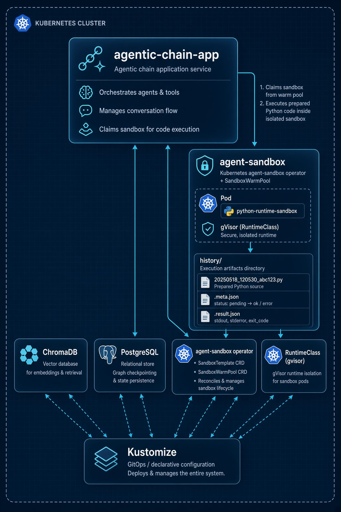
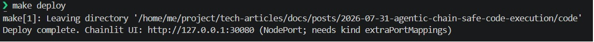
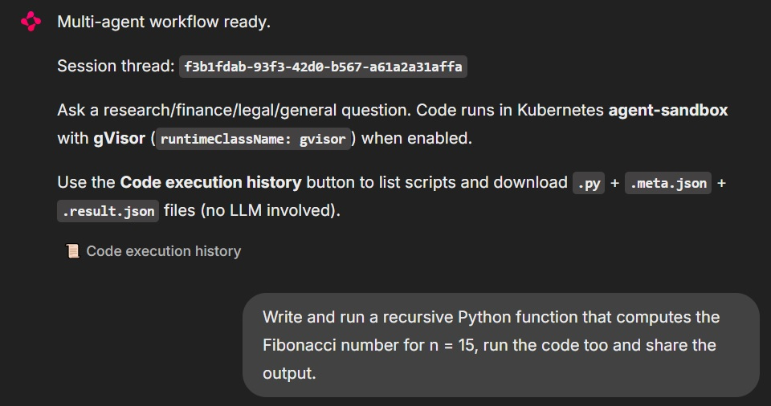
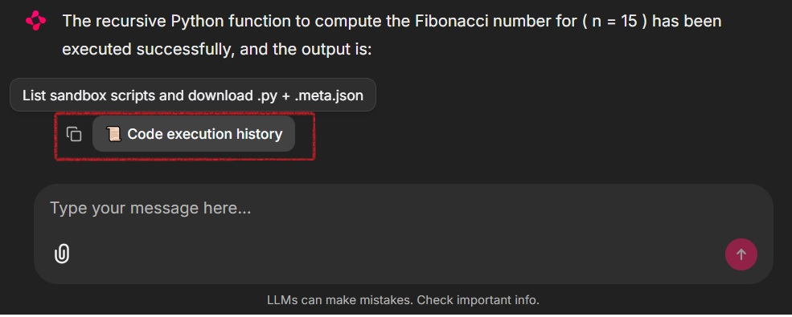
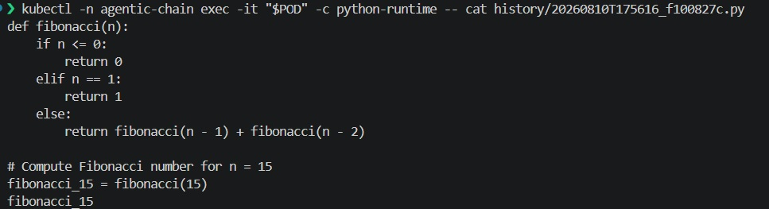

# The AI-powered Agentic Chain: Secure code execution for LLMs


## Prologue

Giving a language model a code interpreter is one of the most useful capabilities you can add to an agentic system — and one of the most dangerous if you treat it casually. When Python runs in the same container (or process) as the planner, the specialist agents, and the chat UI, a single bad tool call can read secrets from the environment, scrape the filesystem, open network sockets toward internal services, or simply exhaust CPU and memory until the whole workload dies. Prompt injection and tool confusion make this worse: the model does not need to be “malicious” for untrusted code to land on your host.

In the earlier article [The AI-powered Agentic Chain](https://tech.mohammadabbasi.com/posts/2026-06-22-agentic-chain/), we built a multi-agent LangGraph workflow. That design already treated tools as first-class citizens. This follow-up keeps that agentic spine and changes *where* code runs. Instead of `exec` inside the application process, the `code_interpreter` tool claims a short-lived pod from a Kubernetes warm pool managed by the [agent-sandbox](https://github.com/kubernetes-sigs/agent-sandbox) operator. 



## Prerequisites

- Docker Engine (or Docker Desktop / compatible runtime)
- `.env` File as explained [here](https://tech.mohammadabbasi.com/posts/2026-06-22-agentic-chain/#creating-the-env-file)

The Makefile under `docs/posts/2026-07-31-agentic-chain-safe-code-execution/code/` installs several binaries into a local `./bin` directory.

## Quick Peek

This section gets the code-base running end to end. Commands assume a Unix-like shell and Docker already available.

1. Clone the repository and enter the code-base directory:

```bash
git clone https://github.com/BrutalHex/tech-articles && \
cd tech-articles/docs/posts/2026-07-31-agentic-chain-safe-code-execution/code
```

2. Create `./.env` with your provider credentials as explained [here](https://tech.mohammadabbasi.com/posts/2026-06-22-agentic-chain/#creating-the-env-file).

3. Deploy the full POC (installs tools into `./bin`, creates a kind cluster with gVisor mounts, builds and smoke-tests the app image, loads images into kind, applies kustomize, and waits for readiness):

```bash
make deploy
```



Useful partial targets if you are iterating: `make tools`, `make setup-kind`, `make docker-build`, `make load-kind`, `make apply`, `make wait-ready`, `make logs`, and `make clean-all` to tear the kind cluster down. Run bare `make` or `make help` for the full list.

4. Open the Chainlit UI at **http://127.0.0.1:30080**. Kind is configured with `extraPortMappings` from host port 30080 to the control-plane node; the app Service uses a fixed NodePort of 30080, so no `kubectl port-forward` is required for the happy path.


5. In the chat, try a prompt that forces the code interpreter, for example:

> Write and run a recursive Python function that computes the Fibonacci number for n = 15, run the code too and share the output.



6. After at least one successful interpreter run, use the **Code execution history** button in the UI. That action is one of the few intentional graph bypasses: it calls `fetch_code_execution_history` directly, lists each `.py` with its companion `.meta.json` and `.result.json`, and attaches downloadable Chainlit `File` elements so you can save all three artifacts.



7. To verify the same bytes on the actual sandbox pod (not only via the UI), list sandbox pods, capture the first pod name, and inspect the history directory inside the runtime container:

```bash
# Sandbox pods created from the warm pool / template; keep the first name
POD=$(kubectl -n agentic-chain get pods -l app=python-runtime-sandbox \
  -o wide --no-headers | awk 'NR==1 {print $1}')  && \
echo "Using sandbox pod: $POD"

# List history files written by the interpreter
kubectl -n agentic-chain exec -it "$POD" -c python-runtime -- ls -la history

# Read a specific script + its result artifact (pick a name from the listing above)
kubectl -n agentic-chain exec -it "$POD" -c python-runtime -- \
  cat history/<timestamp>_<id>.py
kubectl -n agentic-chain exec -it "$POD" -c python-runtime -- \
  cat history/<timestamp>_<id>.result.json
```



## Sandboxed Runtimes

Ordinary containers share the host kernel. That is fine for trusted services; it is a weak story for untrusted agent code. A separate class of technologies sits between “plain runc” and “full nested Kubernetes”: **sandboxed container runtimes** that either interpose a user-space kernel, run each pod in a lightweight VM, or otherwise shrink the trusted computing base exposed to guest processes. **gVisor** and **Kata Containers** are the two names you will meet most often on Kubernetes. Adjacent options in the same design space include **Firecracker-backed microVMs** (often used with Kata), as well as unikernels and WebAssembly-based sandboxes. What they share is the goal: run untrusted workloads without handing them the host kernel and the rest of the cluster network by default.

### Kata

[Kata Containers](https://github.com/kata-containers/kata-containers) wraps each pod (or carefully chosen workload) in a lightweight virtual machine with its own guest kernel. Hardware virtualization gives strong isolation: a kernel exploit inside the guest does not automatically become host kernel compromise. On managed platforms that ship Kata as a product feature, you typically set a `RuntimeClass` whose handler points at Kata and schedule sensitive pods with that class. The cost is heavier cold start and more node-level prerequisites (VMM, firmware, nested virtualization or bare metal) than a pure user-space approach.

### gVisor

[gVisor](https://github.com/google/gvisor) takes a different path: the guest process talks to **runsc**, a user-space kernel that implements Linux system calls and only uses a narrow set of host syscalls. Isolation is not a full hardware VM, but the attack surface of the host kernel is drastically reduced compared with runc. gVisor is what this code-base enables on kind by mounting `runsc` and `containerd-shim-runsc-v1` into the kind node, registering the runsc runtime in containerd, and exposing a Kubernetes `RuntimeClass` named `gvisor` with `handler: runsc`. Sandbox template pods then set `runtimeClassName: gvisor`.

| Environment | gVisor | Kata Containers |
| --- | --- | --- |
| On-prem / self-managed | Supported when you install runsc + containerd/CRI-O integration on nodes | Supported when you install Kata + a VMM on nodes |
| AWS EKS | Supported on worker AMIs / bootstrap that install runsc and the containerd shim (this code-base’s preferred path on EKS) | Possible with custom node setup; not the default EKS product path |
| Azure AKS | Possible with custom node configuration; not the primary “pod sandboxing” product | First-class via AKS Pod Sandboxing (Kata-based) |
| GCP (GKE) | First-class via GKE Sandbox (gVisor) | Available in Kata-oriented setups; gVisor is the common default story |

We chose **gVisor** for this article because it matches kind constraints: no nested virtualization requirement on a laptop, a clear RuntimeClass mapping (`gvisor` → `runsc`), official agent-sandbox examples that pair kind with gVisor, and enough isolation to make “LLM code never shares the app pod’s kernel view” a real property rather than a comment in the code. The repository still defines a `kata` RuntimeClass so you can retarget `SandboxTemplate.spec.podTemplate.spec.runtimeClassName` if your node pool only offers Kata.


## Agent Sandbox Operator

[kubernetes-sigs/agent-sandbox](https://github.com/kubernetes-sigs/agent-sandbox) is a Kubernetes CRD and controller (SIG Apps) for **isolated, stateful, singleton workloads** that fit AI agent runtimes better than long-lived Deployments. It standardizes claim, ready, and shutdown semantics so an application can request a sandbox, wait until it is Ready, execute work, and release or TTL it without inventing a private pod API.

Language and workload support is **image-driven**, not hardcoded to one language. Upstream examples and runtime images cover a **Python runtime sandbox** (what this code-base uses: `registry.k8s.io/agent-sandbox/python-runtime-sandbox`), JupyterLab, VS Code, browser/Playwright and Chrome sandboxes, all-in-one desktop-style environments, and other specialized images. In practice you point a `SandboxTemplate` at any container that exposes the agent-sandbox runtime protocol; Python is the default for code interpreters, while Node, Go services, or custom toolchains appear as different template images rather than separate CRD kinds. This POC pins operator and Python runtime images at **v0.5.4**, matching the `k8s-agent-sandbox==0.5.4` Python client in `requirements.txt`.

We vendor the operator through kustomize rather than a one-off `kubectl apply` script. Under `code/kustomize/agent-sandbox-operator/`, a kustomization pulls the release manifest `sandbox-with-extensions.yaml` for v0.5.4. The top-level `kustomize/kustomization.yaml` then composes three concerns: the operator (cluster-scoped, its own `agent-sandbox-system` namespace), `runtime-isolation` (RuntimeClasses), and `stack` (namespace `agentic-chain` with postgres, chroma, sandbox template/warm pool, and the Chainlit app).

gVisor is wired at two layers. First, kind’s containerd is patched so the `runsc` runtime type exists and host binaries are bind-mounted into the node. Second, `SandboxTemplate` `python-runtime-template` sets `runtimeClassName: gvisor` so every sandbox pod the warm pool pre-creates (and every claim that adopts one) lands on runsc. The app Deployment forces `SANDBOX_BACKEND=agent-sandbox` and `SANDBOX_CONNECTION_MODE=in-cluster` so the Python client never silently falls back to in-process `exec` inside the cluster.

### Objects from the sandbox stack used:

**SandboxTemplate (`python-runtime-template`):** Declares the pod shape for code execution — Python runtime image, non-root user, dropped capabilities, readiness on port 8888, and `runtimeClassName: gvisor`. Claim-time env and volume injection are disallowed so warm-pool adoption stays on the fast, hardened path.

**SandboxWarmPool (`python-sandbox-warmpool`):** Keeps `replicas: 1` pre-warmed sandbox ready in `agentic-chain`, referencing the template above so the first interpreter call does not pay a full cold start on every chat session.

**SandboxClaim (created at runtime by the client):** The application does not hand-author claim YAML; `SandboxClient.create_sandbox(warmpool=...)` issues a claim that adopts a warm pool member. Claim labels `app.kubernetes.io/part-of=agentic-chain` and `app.kubernetes.io/component=code-interpreter` allow reattach after process restarts instead of leaking extra pods.

**Sandbox (controller-managed):** The concrete singleton workload behind a ready claim. History listing and `kubectl exec` target the pods associated with these sandboxes (`app=python-runtime-sandbox`).

**RuntimeClass (`gvisor`, `kata`):** Cluster objects that map logical isolation names to node handlers (`runsc` and `kata`). Only `gvisor` is required for the default path; `kata` is present for retargeting.


## Kustomize Integration

Kind is not left as a generic empty cluster. `kustomize/kind-config.yaml.tpl` is rendered by the Makefile into `kind-config.generated.yaml` by substituting `__BIN_DIR__` with the absolute path to `./bin`. That generated config does three important things for agent-sandbox: it registers the runsc runtime under containerd’s CRI plugin, bind-mounts host `runsc` and `containerd-shim-runsc-v1` into `/usr/local/bin` on the control-plane node, and publishes host port **30080** so the NodePort Service for the UI is reachable without port-forward.

**Warm pools** sit in `kustomize/sandbox/`. The template describes *how* a sandbox runs; the warm pool describes *how many* ready copies to keep. With `replicas: 1`, the controller maintains one spare Python runtime. When the app claims the pool, that spare is adopted, and the controller begins warming a replacement. For production you would raise replicas, add PDB/network policies from upstream examples, and consider PVC-backed `/app/history` if audit data must **survive** pod replacement.

The app overlay (`kustomize/app/`) packages RBAC for the `k8s-agent-sandbox` client (claims, warm pools, templates, sandboxes, pods, services), the Chainlit Deployment with init containers that wait for Chroma and run `seed_chroma.py`, and the NodePort Service. Together with `base/` (postgres + chroma) and `stack/` (namespace + image tag), `make apply` installs a complete vertical slice: operator, RuntimeClasses, data plane, warm pool, and UI.


## Code Integration

Agent-sandbox appears in the application only where code must leave the trusted control plane. The tools package under `src/tools/` splits concerns into:
- shared sandbox helpers (`sandbox.py`)
- the interpreter tool (`code_interpreter.py`)
- history listing (`code_execution_history.py`)
- web search

The control plane is still the multi-agent chain from the earlier article: **planner → specialist(s) → aggregator → synthesizer → critic**, with optional replan.

Claiming a sandbox uses the official Python client with in-cluster connection config, reattaches a ready claim when possible, then creates from the warm pool:

```python
def claim_sandbox():
    """Claim (or reuse) a warm-pool sandbox for code execution + history."""
    client = get_sandbox_client()
    warmpool = os.getenv("SANDBOX_WARMPOOL", "python-sandbox-warmpool")
    namespace = os.getenv("SANDBOX_NAMESPACE", "agentic-chain")
    # ... lock, reattach existing labeled claim if Ready ...
    _sandbox_handle = client.create_sandbox(
        warmpool=warmpool,
        namespace=namespace,
        sandbox_ready_timeout=timeout,
        shutdown_after_seconds=shutdown_after if shutdown_after > 0 else None,
        labels=dict(_CLAIM_LABELS),
    )
    return _sandbox_handle
```

The interpreter **never** runs model code with process-local `exec`. It prepares the source, claims a sandbox, persists that prepared source for audit, executes the on-disk file, writes a separate result artifact, and returns a header that ties stdout to claim, sandbox, history, and result identifiers:

```python
def _agent_sandbox_exec(code: str) -> str:
    prepared = ensure_stdout_visibility(code)  # comment + auto-print trailing value
    sandbox = claim_sandbox()
    history = write_history(sandbox, prepared)  # what ran is what is on disk
    history_path = history["code_path"]

    quoted = shlex.quote(history_path)
    result = sandbox.commands.run(
        f"python3 {quoted}",
        timeout=int(os.getenv("SANDBOX_EXEC_TIMEOUT", "60")),
    )
    # stdout/stderr/exit_code → write_history_result(...result.json)
    # header: claim / sandbox / history / result paths + body
```

## Code Execution History

**Simplified explanation**

Every agent-sandbox interpreter run follows this sequence:

1. It calls `write_history` with the **prepared** source (after `ensure_stdout_visibility`).
2. That helper creates a `history/` folder and writes two files:
   - A timestamped `.py` file (the source + instruction comment + any auto-`print` rewrite)
   - A sibling `.meta.json` marked as `"pending"`
3. The sandbox then executes exactly that `.py` file (`python3 history/….py`), so the audited source and the running process are identical.
4. After the process finishes, `write_history_result` writes a separate `.result.json` and updates the `.meta.json` with the final status.

```python
def write_history(sandbox, code: str) -> dict:
    stamp = datetime.now(timezone.utc).strftime("%Y%m%dT%H%M%S")
    short_id = uuid.uuid4().hex[:8]
    base = f"{stamp}_{short_id}"
    code_path = f"history/{base}.py"
    meta_path = f"history/{base}.meta.json"
    result_path = f"history/{base}.result.json"
    # ... write code_path + meta (status=pending) ...
    return {
        "base": base,
        "code_path": code_path,
        "meta_path": meta_path,
        "result_path": result_path,
    }


def write_history_result(sandbox, history: dict, *, stdout, stderr, exit_code) -> str:
    result_obj = {
        "path": history["result_path"],
        "code_path": history["code_path"],
        "claim": sandbox.claim_name,
        "sandbox_id": sandbox.sandbox_id,
        "exit_code": int(exit_code),
        "stdout": stdout or "",
        "stderr": stderr or "",
    }
    # ... write history["result_path"] + refresh meta (status=ok|error) ...
    return history["result_path"]
```

## Conclusion

Safe code execution is not a nicety for agentic systems; it is the difference between a research prototype and a workload you can put near real data. An LLM that can run Python is powerful precisely because that Python is unconstrained relative to natural language — which is exactly why it must not share the kernel, credentials, and network identity of the control-plane application.

This code-base keeps the multi-agent design from the earlier Agentic Chain article and moves interpretation behind Kubernetes **agent-sandbox**, a **SandboxWarmPool** of Python runtimes, and **gVisor** via `runtimeClassName`. History on the sandbox filesystem (`.py`, `.meta.json`, `.result.json`), a dedicated UI download path, and standard kubectl inspection close the loop for operators who need to see what actually ran. Prompting and graph-side guards keep the same planner–specialist–critic loop precise enough that a successful sandbox run is not discarded for narrative polish. The next hardening steps are network policies, durable volumes for history, higher warm-pool replica counts, and — where your platform prefers hardware isolation — switching the template to the `kata` RuntimeClass without rewriting the agent code.
